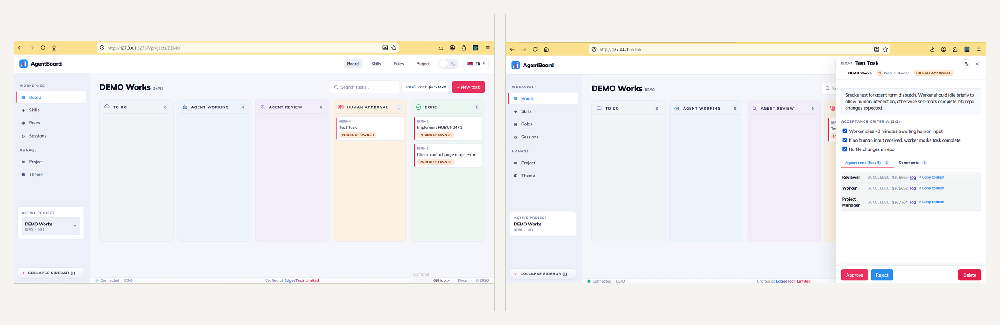
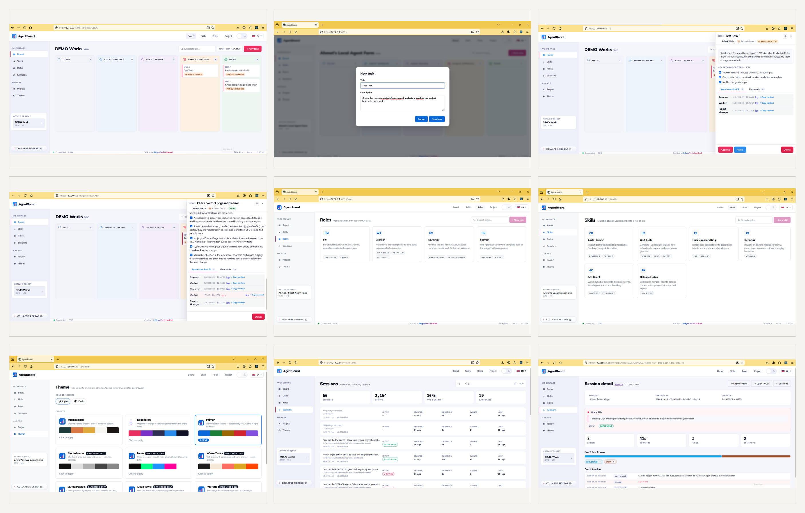

<div align="center">

# 🎛️ AgentBoard

### Run AI agents like a kanban team — locally, with full cost + audit trails.

[](./plugins/claude-code/.claude-plugin/plugin.json)
[](./LICENSE)
[](https://nodejs.org)
[](https://docs.claude.com/en/docs/claude-code)
[]()

**🟦 PM** → **🟧 Worker** → **🟪 Reviewer** → **🟩 Human** — a real workflow, not a chat window.

</div>

---

## 🚀 Quick start

> [!IMPORTANT]
> AgentBoard is a **Claude Code plugin**. Install from inside any Claude Code session — no `git clone`, no `npm install`.

```bash
/plugin marketplace add edgeetech/agentboard
/plugin install agentboard@agent-board-local
/reload-plugins
/agentboard:open      # boots local server + opens UI in your browser
```

**Requires:** Node ≥ 22 *or* Bun ≥ 1.x · `claude` CLI ≥ 2.0.0 · `ANTHROPIC_API_KEY` env or active OAuth (`claude /login`) · Windows / macOS / Linux.

---

<div align="center">

[](./docs/images/collage-hero.png)

<sub>The board on the left, a task detail with runs + cost + acceptance criteria on the right. <a href="./docs/images/collage-hero.png">Click to enlarge.</a></sub>

</div>

---

## ⚡ Why AgentBoard?

Multi-agent AI is powerful, but the day-to-day is messy:

- 💸 No idea what each run **cost** until the bill arrives.
- 🕵️ Can't see **why** an agent did what it did — logs scattered.
- 🔁 "Just one more retry" turns into runaway loop.
- ☁️ Only options are cloud SaaS dashboards that ship your prompts off-box.

**AgentBoard fixes that.** Local kanban board, one SQLite per project, real-time cost per run, hard ceiling on rework loops, human approval gate before anything ships.

---

## ✨ What's inside

| | |
|---|---|
| 🟦🟧🟪🟩 **Four roles, one flow** | PM enriches → Worker codes → Reviewer verifies → Human approves. Pick **WF1** (full loop) or **WF2** (skip Reviewer). |
| 🕹️ **Auto *or* semi-auto mode** | **Auto** — agents drive transitions end-to-end. **Semi** — you drive status changes, agents only annotate (comments + ACs). Switch per project, any time. |
| 🧾 **Acceptance Criteria, enforced** | PM writes 3–7 testable ACs. Reviewer must check them. Server rejects finishes that skip the audit. |
| 💰 **Real-time cost per run** | Every run parses SDK usage events and stamps `cost_usd` from latest Opus / Sonnet / Haiku pricing. Project header shows all-time, 7d, 30d totals. |
| 🔁 **Bounded rework loop** | Max 3 reviewer rejects per task. After that, task stalls with "Retry from Worker" button — no runaway agents. |
| 🔄 **Automatic retry with backoff** | Failed runs automatically re-enqueue with exponential backoff (1s → 2s → 4s, capped at 5min, max 3 attempts). Retry history logged in `retry_state` per run. Configurable via `max_retry_attempts` / `max_retry_backoff_ms`. |
| 🔗 **External tracker sync** | Connect Linear, GitHub Issues, or GitLab to a project. Background poller creates agentboard tasks from incoming issues, marks tasks done when issues hit terminal state. Config via `tracker_config` table; REST API at `/api/projects/{code}/tracker`. |
| 🛡️ **Workspace path safety** | Per-task workspaces validated against path traversal (`../`) and symlink attacks before creation. Artifact caches (`.cache`, `node_modules/.cache`, `.vite`, `.turbo`, etc.) cleaned between runs. Shell lifecycle hooks (`afterCreate`, `beforeRun`, `afterRun`, `beforeRemove`) with 30s timeout. |
| 🔒 **Local-only by design** | Binds `127.0.0.1`, DNS-rebind guard, Bearer + per-run rotated tokens, whitelisted child env. AWS / GitHub / SSH secrets in your shell are **not** passed to spawned agents. |
| 🪝 **Step into any run** | Each run gets `--session-id`. One click copies `claude --resume <id>` so you can jump into the live transcript from your terminal. |
| 🎨 **9 themes, light + dark** | AgentBoard, EdgeeTech, Primer, Monochrome, Neon, Warm Tones, Muted Pastels, Deep Jewel, Vibrant. |

**Server:** Node ≥ 22, vanilla `node:http`, `node:sqlite` (built-in). The HTTP server uses only Node.js standard library; the overall plugin package includes a small set of production dependencies (Claude SDK, Commander, LiquidJS, Pino) for agent execution and background services.

---

## 🖼️ Product tour

Nine screens in one image — board, task creation, run detail with cost + ACs, comment audit trail, roles, skills, themes, sessions index, session timeline.

<div align="center">

[](./docs/images/collage-tour.png)

<sub><a href="./docs/images/collage-tour.png">Click to enlarge</a> — or browse individual screenshots in <a href="./docs/images/">docs/images/</a>.</sub>

</div>

---

## 🧠 How it works

```
   Your Claude Code session
             │  (stdio MCP — read-only board + approve/reject)
             ▼
   ┌──────────────────────────────────────────────────────────────┐
   │  AgentBoard core server  (Node, 127.0.0.1)                   │
   │  • REST + JSON-RPC HTTP MCP                                  │
   │  • Per-project SQLite (WAL, schema v3)                       │
   │  • Executor: Claude Agent SDK (in-process, no subprocess)    │
   │  • RetryManager: exponential backoff, max 3 attempts         │
   │  • TrackerPoller: Linear / GitHub / GitLab background sync   │
   │  • Reaper: 15min heartbeat timeout                           │
   └──────────┬───────────────────────────────────────────────────┘
              │
   ┌──────────┴────────────┐
   ▼                       ▼
  PM agent            Worker agent       (and Reviewer in WF1)
  └─ writes ACs       └─ edits files
                        no commits, no branches
```

**State machine:**

```
  todo ─▶ agent_working ─▶ agent_review ─▶ human_approval ─▶ done
                            └─── rework loop, max 3 ────┘
```

**Two workflows, picked per project at creation:**

- **WF1** — `Todo → Working → Review → Approval → Done` (full loop with Reviewer)
- **WF2** — `Todo → Working → Approval → Done` (skip Reviewer step)

**Two dispatch modes, switchable any time:**

- 🤖 **Auto** *(default)* — agents claim runs, change status, hand off. You only step in at Human Approval.
- 🕹️ **Semi** — you stay in the driver's seat. Agents are blocked from status/assignee changes; they may only add comments and acceptance criteria. Server returns `semi-automated mode: agents may not change status/assignee — add comments only; user drives transitions` if a run tries.

---

## 🛠️ Slash commands

| Command | Does |
|---|---|
| `/agentboard:open` | Boots (or reuses) local server, opens UI in default browser. |
| `/agentboard:stop` | SIGTERMs the server. Children in flight finish on their own. |
| `/agentboard:doctor` | Health checklist: Node/Bun version, claude CLI, auth, data dir, DB schema, pricing freshness, available updates. |
| `/agentboard:update` | Checks GitHub `main` for newer plugin version, prints upgrade commands. |
| `/agentboard:delete-project` | Interactive: pick project → confirm → DB moved to `~/.agentboard/trash/` (manual restore possible). |

---

## 🔒 Security & privacy

- **127.0.0.1 only.** Server refuses any `Host` header that isn't `127.0.0.1:<port>` or `localhost:<port>` (DNS-rebind guard, returns 421).
- **Bearer + per-run tokens.** 32-byte hex token in `~/.agentboard/config.json` (0600 on Unix, ACL'd on Windows). Each run gets a `run_token` issued exactly once at `claim_run`.
- **Whitelisted child env.** Spawned agents receive only `PATH`, `HOME`, `USER`, `LANG`, `TZ`, Claude auth vars, and Windows OS basics. AWS, GitHub, SSH, GCP, cloud-SDK secrets dropped.
- **CSP nonce + HttpOnly cookie** on the UI. No inline scripts without nonce.
- **No telemetry.** Nothing leaves your machine. Logs at `~/.agentboard/logs/<run_id>.ndjson` are full Claude transcripts — treat data dir as sensitive.

---

## 📂 Where data lives

Outside the repo, untouched by plugin upgrades:

```
~/.agentboard/                  (%USERPROFILE%\.agentboard on Windows)
  projects/<code>.db            one SQLite per project (WAL, schema v3)
  logs/<run_id>.ndjson           Claude SDK structured events
  logs/<run_id>.err.log         captured stderr
  run-configs/<id>.json         tmp MCP config per run (deleted on exit)
  trash/<code>-<timestamp>.db   deleted projects (manual restore possible)
  config.json                   port, pid, token, server_id, active project
  server.lock                   single-instance lock
```

**Per-project DB tables (schema v3):**

| Table | Purpose |
|---|---|
| `task` | Tasks with status, assignees, acceptance criteria |
| `task_history` | Full audit trail of every status transition |
| `task_attachment` | Files or URLs attached to a task |
| `agent_run` | Agent runs with cost, session-id, attempt count |
| `retry_state` | Retry history per run (backoff delay, error, next attempt) |
| `tracker_config` | External tracker connections per project |
| `tracker_issue` | Synced issues from external trackers |
| `meta` | DB schema version |

---

## 🧰 Tech stack

| Layer | Stack |
|---|---|
| **Server** | Node ≥ 22, vanilla `node:http`, `node:sqlite` (built-in). Production deps: `@anthropic-ai/claude-agent-sdk` · `commander` · `liquidjs` · `pino`. |
| **Agent runner** | `@anthropic-ai/claude-agent-sdk` — in-process, streaming, no subprocess required. |
| **UI** | React 18 · Vite · TanStack Query · Zustand · @dnd-kit · react-i18next |
| **MCP** | Two surfaces — `abrun` (HTTP, for spawned runs) and `agentboard` (stdio, for your interactive session). Names differ deliberately so `--strict-mcp-config` filters cleanly. |
| **Pricing** | Opus 4.7 / Sonnet 4.6 / Haiku 4.5, versioned. Unknown model → `$0` + `uncosted` flag — never silently wrong numbers. |
| **Tests** | Vitest · 91 tests across 10 files (state machine, retry, tracker, workspace safety, supervisor, turn timeout, rate limiter, prompt builder, event bus). |

---

## 🔗 External tracker sync

Connect a Linear, GitHub Issues, or GitLab project to auto-populate agentboard tasks:

```bash
# POST /api/projects/{code}/tracker
{
  "kind": "github",
  "api_key_env_var": "GITHUB_TOKEN",
  "project_slug": "owner/repo",
  "active_states": ["open"],
  "terminal_states": ["closed", "merged"],
  "poll_interval_ms": 300000
}

# Enable / disable polling
POST /api/projects/{code}/tracker/enable
POST /api/projects/{code}/tracker/disable

# Force an immediate sync
POST /api/projects/{code}/tracker/sync

# List synced issues
GET /api/projects/{code}/tracker/issues
```

The background `TrackerPoller` starts 5 s after boot, checks each configured project on its own schedule, and syncs new/updated issues as agentboard tasks. Deleted or terminal issues are resolved automatically.

---

## 🔄 Automatic retry with backoff

Failed agent runs (non-`completed` status or unhandled exception) are automatically retried with exponential backoff:

| Attempt | Delay |
|---|---|
| 1 → 2 | 1 s |
| 2 → 3 | 2 s |
| 3 (max) | permanent failure |

Configure per-project in the project config or via env:

```json
{ "max_retry_attempts": 3, "max_retry_backoff_ms": 300000 }
```

Each retry creates a new `agent_run` row with an incremented `attempt` counter, and a `retry_state` row recording the delay and error message. The `run.failed` SSE event carries `{ permanent: true }` on the last attempt.

---


Spawned agents run with `--strict-mcp-config`, so only the per-run `abrun` HTTP MCP is loaded by default. Two opt-in knobs:

1. **Inherit `~/.claude.json` MCPs** — set `"inherit_user_mcps": true` in `~/.agentboard/config.json` (or scope it: `["mcp-atlassian"]`).
2. **Custom MCPs** — drop a `mcpServers` block in `~/.agentboard/mcps.json`, merged into the per-run config.

The `Skill` tool is in every role's allowlist, so agents can invoke your installed skills (caveman, ctx-*, etc.) via `Skill(name)`.

---

## 🪝 Stepping into a running agent

Each run is spawned with `--session-id <uuid>`. The task detail panel has an **Open in CLI** button per run that copies:

```
claude --resume <session-id>
```

Paste in a terminal at the project repo and you're inside the agent's session. If the run is still live, the button reads **Join in CLI** and warns you that resume may fork the session.

---

## 🗺️ Roadmap

- 🛡️ Per-run rate limiting on MCP mutations (v1.1)
- ✅ Stricter UTF-8 body validation (v1.1)
- 💱 `/agentboard reprice` skill — recompute historical run costs when Anthropic prices change
- 🔍 Auto-discover plugin-registered MCPs (today, mirror them into `~/.claude.json` or `mcps.json`)

---

## 🤝 Contributing

Issues, PRs, feedback welcome at [github.com/edgeetech/agentboard](https://github.com/edgeetech/agentboard).

For internals — state machine rules, dispatch logic, sharp edges — see [CLAUDE.md](./CLAUDE.md).

---

## 📄 License

[Elastic License 2.0](./LICENSE). You may self-host and modify freely. You may **not** offer AgentBoard as a managed service to third parties.

---

<div align="center">

Crafted at **EdgeeTech Limited** · [github.com/edgeetech/agentboard](https://github.com/edgeetech/agentboard)

⭐ If AgentBoard helps you ship cleaner agent workflows, drop a star — helps others find it.

</div>
