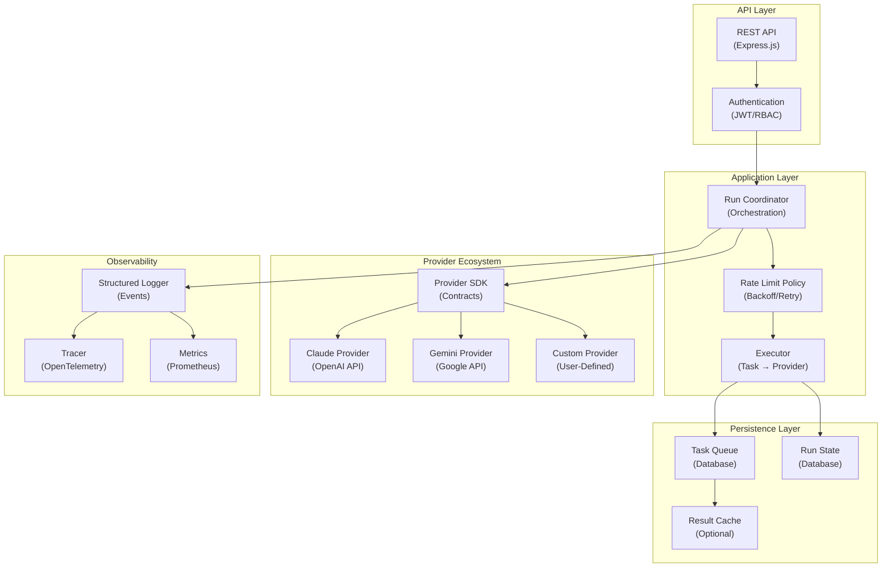
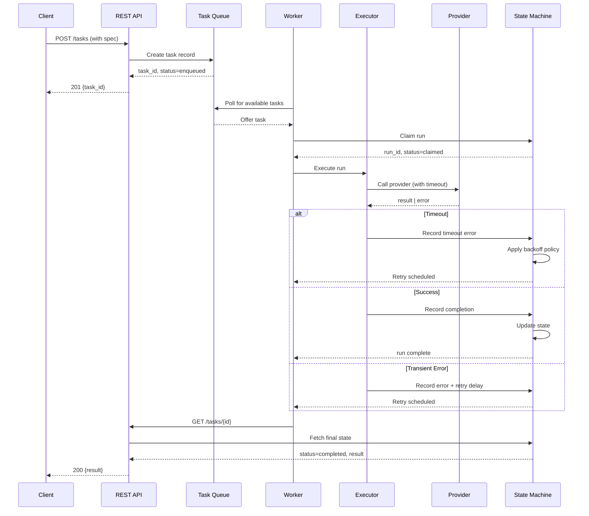

# Architecture Overview

AgentBoard implements a modular multi-provider orchestration system that decouples Engine logic from provider-specific implementations.

## System Architecture



## Data Flow: Executing a Task



## Provider Integration Pattern

Each provider implements the SDK contract without requiring Engine changes:

```
providers/
├── claude/                       # OpenAI API provider
│   ├── manifest.json            # Provider metadata
│   ├── src/
│   │   ├── index.ts             # Entry point
│   │   └── handler.ts           # OpenAI API integration
│   ├── dist/                    # Pre-bundled (verified in CI)
│   ├── package.json
│   └── tsconfig.json
├── gemini/                       # Google API provider
│   ├── manifest.json
│   ├── src/index.ts
│   └── dist/
└── custom-llm/                   # User-provided provider
    ├── manifest.json
    └── src/index.ts
```

**Provider Contract** (`plugin-sdk`):

```ts
interface ProviderHandler {
  // Execute task with provider-specific API
  execute(request: ExecuteRequest): Promise<ExecuteResponse>;
  
  // Validate provider auth at startup
  validateConnection(): Promise<void>;
  
  // Declare required environment variables
  getEnvVariables(): EnvironmentVariable[];
}
```

## State Machine: Run Lifecycle

```mermaid
stateDiagram-v2
    [*] --> ENQUEUED: Create task
    ENQUEUED --> CLAIMED: Worker claims
    CLAIMED --> EXECUTING: Begin execution
    EXECUTING --> COMPLETED: Success
    EXECUTING --> FAILED: Error
    FAILED --> ENQUEUED: Retry scheduled
    COMPLETED --> [*]
    
    note right of EXECUTING
        Rate limit policy enforces
        backoff + retry strategy
    end
```

## Dependency Isolation

AgentBoard uses architecture checks to prevent:
- Engine importing from providers (provider-specific logic leakage)
- Providers importing from each other (provider coupling)
- Framework code from tightly coupling to persistence

```
✅ ALLOWED IMPORTS
- Engine → plugin-sdk (contracts only)
- Provider → plugin-sdk (contracts only)
- Provider → @provider/shared (peer utilities)

❌ FORBIDDEN IMPORTS
- Engine → Provider code
- Provider → Engine code
- Provider A → Provider B code
```

Enforced by `.eslintrc.cjs` architecture rule (see Configuration).

## Configuration Hierarchy

```
1. Environment Variables (highest priority)
   - PROVIDER_* (provider-specific API keys)
   - LOG_LEVEL (debug|info|warn|error)
   - QUEUE_POLL_INTERVAL_MS
   
2. Manifest Files (provider defaults)
   - providers/*/manifest.json
   - Rate limits, concurrency, timeouts
   
3. Code Defaults (lowest priority)
   - engine/src/application/constants.ts
   - Global timeouts, backoff strategy
```

Provider env variables are **validated at startup** and fail-fast if missing.

## Deployment Units

| Component | Deploy Strategy | Restart Impact |
|-----------|-----------------|-----------------|
| API Server | Stateless, scale horizontally | None (clients reconnect) |
| Task Queue (DB) | Persistent, backup regularly | All workers pause (graceful) |
| Worker Pool | Stateless, scale horizontally | In-flight tasks timeout & retry |
| Providers (bundles) | Pre-built, verified in CI | Must rebuild & redeploy if changed |

## Performance Targets

- **API Response**: p50 <100ms, p99 <200ms
- **Queue Latency**: <5s (enqueue → claim)
- **Execution**: <30s (invoke → result)
- **Success Rate**: >95%
- **Cost/Run**: <$0.10

See [Observability & SLOs](./observability-slos.md) for full metrics.

## Related Documentation

- [Provider Integration Guide](../contributing/adding-a-plugin.md)
- [Observability & SLOs](./observability-slos.md)
- [Database Schema](../database/schema.md)
- [API Reference](../api/index.md)
